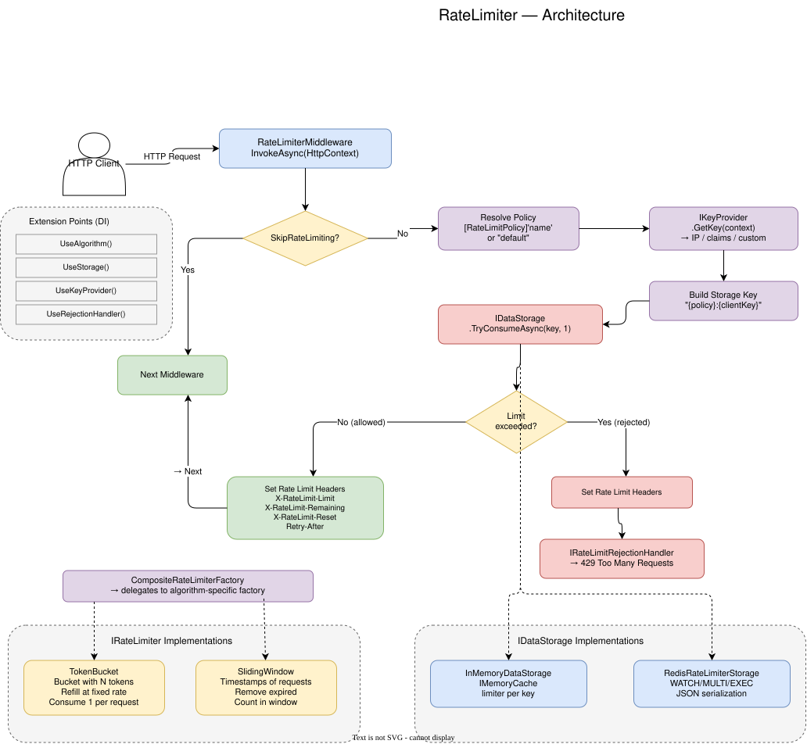

# RateLimiter

HTTP request rate limiting middleware for ASP.NET Core.

## Table of Contents

- [Overview](#overview)
- [Architecture](#architecture)
  - [Request Processing](#request-processing)
  - [State Storage](#state-storage)
  - [Multi-instance with Redis](#multi-instance-with-redis)
- [Getting Started](#getting-started)
- [Algorithms](#algorithms)
  - [Token Bucket](#token-bucket)
  - [Sliding Window](#sliding-window)
- [Policies](#policies)
- [Storage Providers](#storage-providers)
  - [InMemory](#inmemory)
  - [Redis](#redis)
- [Client Identification](#client-identification)
- [Handling 429](#handling-429)
- [HTTP Headers](#http-headers)
- [Attributes](#attributes)
- [Extensibility](#extensibility)
  - [Custom Algorithm](#custom-algorithm)
  - [Custom Storage](#custom-storage)
  - [Custom 429 Handler](#custom-429-handler)
  - [Custom Client Identifier](#custom-client-identifier)
- [Full Example](#full-example)
- [Dependencies](#dependencies)

---

## Overview

A middleware library that inspects each incoming HTTP request and decides whether to allow it or reject it with a 429 status code.

Two built-in algorithms:
- **Token Bucket** — a bucket of tokens that refills at a configured rate
- **Sliding Window** — a sliding time window that counts requests

Two storage types:
- **InMemory** — for single-instance deployments
- **Redis** — for distributed deployments

Every component can be replaced with a custom implementation via DI.

---

## Architecture



### Request Processing

Every HTTP request passes through the middleware in the following order:

```
HTTP Request
    │
    ▼
┌───────────────────────────────┐
│  1. SkipRateLimiting?         │
│     Yes → pass through        │
│     No → continue             │
└───────────────┬───────────────┘
                │
                ▼
┌───────────────────────────────┐
│  2. Resolve policy            │
│     [RateLimitPolicy("x")]    │
│     → if none → "default"     │
└───────────────┬───────────────┘
                │
                ▼
┌───────────────────────────────┐
│  3. Get client key            │
│     IKeyProvider.GetKey()     │
│     → IP / claims / custom    │
└───────────────┬───────────────┘
                │
                ▼
┌───────────────────────────────┐
│  4. Build storage key         │
│     "{policyName}:{clientKey}"│
└───────────────┬───────────────┘
                │
                ▼
┌───────────────────────────────┐
│  5. IDataStorage              │
│     .TryConsumeAsync(key)     │
│                               │
│  Limiter exists?              │
│  No → create via              │
│       IRateLimiterFactory     │
│  Yes → try to consume         │
│       token/request           │
└───────────────┬───────────────┘
                │
        ┌───────┴───────┐
        ▼               ▼
    ┌──────────┐     ┌──────────┐
    │Allowed   │     │Rejected  │
    │          │     │          │
    │Set       │     │Set       │
    │headers   │     │headers   │
    │          │     │          │
    │→ next    │     │429 via   │
    │middleware│     │IRateLimit│
    │          │     │Rejection │
    │          │     │Handler   │
    └──────────┘     └──────────┘
```

### State Storage

A limiter is created on the first request from a client for a given policy and stored in the storage provider.

```
InMemory:

┌───────────────────────────────────────────────┐
│  IMemoryCache                                 │
│                                               │
│  "api:192.168.1.1"  → TokenBucket             │
│                        tokens=73              │
│                        lastRefill=10:30:15    │
│                        TTL=1h (sliding)       │
│                                               │
│  "strict:10.0.0.5"  → SlidingWindow           │
│                        requests=[10:29, 10:31]│
│                        TTL=1h (sliding)       │
│                                               │
│  SizeLimit: 10,000 entries                    │
│  When evicted → next request gets             │
│  full limit reset                             │
└───────────────────────────────────────────────┘


Redis:

┌──────────────────────────────────────────────┐
│  Redis Database                              │
│                                              │
│  KEY "ratelimiter:api:192.168.1.1"           │
│  VALUE '{"Tokens":73,"LastRefill":"..."}'    │
│  TTL 10 minutes                              │
│                                              │
│  KEY "ratelimiter:strict:10.0.0.5"           │
│  VALUE '{"Requests":["...","..."]}'          │
│  TTL 10 minutes                              │
│                                              │
│  Entries are updated only on TryConsume.     │
│  GetRemaining/GetReset are read-only         │
│  and do not extend TTL.                      │
└──────────────────────────────────────────────┘
```

### Multi-instance with Redis

With multiple application instances behind a load balancer, InMemory won't work — each instance maintains its own state, so a client with IP 1.2.3.4 could get 100 tokens on instance A and another 100 on instance B.

Redis solves this — all instances read and write to the same entry:

```
┌─────────────┐     ┌─────────────┐
│  Instance A │     │  Instance B │
│  (Kestrel)  │     │  (Kestrel)  │
└──────┬──────┘     └──────┬──────┘
       │                   │
       │  WATCH key        │  WATCH key
       │  GET state        │  GET state
       │  Modify limiter   │  Modify limiter
       │  MULTI            │  MULTI
       │  SET state        │  SET state
       │  EXEC             │  EXEC
       │                   │
       ▼                   ▼
┌──────────────────────────────────────┐
│  Redis                               │
│                                      │
│  "ratelimiter:api:1.2.3.4"           │
│  → single state, both instances      │
│    see the same tokens               │
└──────────────────────────────────────┘
```

Race conditions are prevented using **optimistic locking** (WATCH/MULTI/EXEC). If another instance modifies the key between WATCH and EXEC, the transaction is rolled back and retried (up to 10 attempts by default, configurable via `RedisStorageOptions.MaxRetries`).

```
Instance A                    Redis                     Instance B
    │                           │                           │
    │── WATCH key ──────────────│                           │
    │── GET key ────────────────│                           │
    │                           │                           │
    │  deserialize              │       WATCH key ──────────│
    │  consume token            │       GET key ────────────│
    │  serialize                │                           │
    │                           │       deserialize         │
    │── MULTI ──────────────────│       consume token       │
    │── SET new_state ──────────│       serialize           │
    │── EXEC ───────────────────│                           │
    │                           │       MULTI ──────────────│
    │   OK, committed           │       SET new_state ──────│
    │                           │       EXEC ───────────────│
    │                           │                           │
    │                           │       FAIL (key changed)  │
    │                           │       → retry from WATCH  │
```

---

## Getting Started

```csharp
// Program.cs
var builder = WebApplication.CreateBuilder(args);

builder.Services.AddRateLimiter(options =>
{
    options.AddTokenBucketLimiter("default", tb =>
    {
        tb.TokenLimit = 100;
        tb.TokensPerPeriod = 10;
        tb.ReplenishmentPeriod = TimeSpan.FromSeconds(1);
    });
});

var app = builder.Build();

app.UseRateLimiter();   // ← register after UseRouting(), before MapControllers()
app.MapControllers();
app.Run();
```

`AddRateLimiter` throws `InvalidOperationException` if no policies are registered.

---

## Algorithms

### Token Bucket

Each client is given a pool of tokens. Each request consumes one token. If no tokens are available — 429. Tokens refill continuously.

```csharp
options.AddTokenBucketLimiter("api", tb =>
{
    tb.TokenLimit = 100;
    tb.TokensPerPeriod = 10;
    tb.ReplenishmentPeriod = TimeSpan.FromSeconds(1);
});
```

| Parameter | Type | Description | Constraint |
|-----------|------|-------------|------------|
| `TokenLimit` | `int` | Maximum bucket capacity | > 0 |
| `TokensPerPeriod` | `int` | Tokens added per `ReplenishmentPeriod` | > 0 |
| `ReplenishmentPeriod` | `TimeSpan` | Refill interval | > 0 |

**Example:** `TokenLimit=100, TokensPerPeriod=10, ReplenishmentPeriod=1s` — the bucket holds 100 tokens, refills at 10 tokens per second. With a full bucket the client can make 100 requests in a burst, then 10 requests per second.

**Behavior:**
- Refill happens on each `TryConsume` call based on elapsed time
- Tokens are integer — fractional tokens are truncated
- Capacity never exceeds `TokenLimit`

---

### Sliding Window

Each request is recorded with a timestamp. On each check, all timestamps older than `Window` are removed. If remaining timestamps >= `RequestsLimit` — 429.

```csharp
options.AddSlidingWindowLimiter("strict", sw =>
{
    sw.RequestsLimit = 200;
    sw.Window = TimeSpan.FromMinutes(1);
});
```

| Parameter | Type | Description | Constraint |
|-----------|------|-------------|------------|
| `RequestsLimit` | `int` | Maximum requests in the window | > 0 |
| `Window` | `TimeSpan` | Window duration | > 0 |

**Example:** `RequestsLimit=200, Window=1min` — no more than 200 requests per minute.

**Behavior:**
- The window is truly sliding — no fixed ticks or boundaries
- Old timestamps are lazily removed on the next request
- `GetReset()` returns the time when the oldest request will fall out of the window

---

## Policies

A policy is a named rate limit configuration. Each policy is bound to one algorithm.

```csharp
options.AddTokenBucketLimiter("api", tb => { ... });       // policy "api" → Token Bucket
options.AddSlidingWindowLimiter("strict", sw => { ... });   // policy "strict" → Sliding Window
```

A single application can have multiple policies with different algorithms and parameters. Each endpoint uses its policy via `[RateLimitPolicy("name")]`.

If no attribute is specified, the `"default"` policy is used. If the `"default"` policy is not registered, `InvalidOperationException` is thrown on the first request to that endpoint.

---

## Storage Providers

### InMemory

Registered by default. Limiter state is stored in `IMemoryCache`.

```csharp
// default settings
builder.Services.AddRateLimiter(options => { ... });

// custom settings
builder.Services.AddRateLimiter(options => { ... })
    .UseInMemoryStorage(
        cacheOptions =>
        {
            cacheOptions.SizeLimit = 50_000;
        },
        entryOptions =>
        {
            entryOptions.SlidingExpiration = TimeSpan.FromMinutes(30);
            entryOptions.Size = 1;
        });
```

| Parameter | Default | Description |
|-----------|---------|-------------|
| `SizeLimit` | 10,000 | Maximum cache entries |
| `SlidingExpiration` | 1 hour | Entry TTL (reset on each access) |
| `Size` | 1 | Entry size in cache units |

When the cache is full, entries are evicted by LRU. Evicted entry = the client gets a full limit reset.

---

### Redis

Limiter state is stored in Redis. Serialized as JSON.

#### Option 1: Connection string

```csharp
// Default storage settings
builder.Services.AddRateLimiter(options => { ... })
    .UseRedis("localhost:6379");

// Custom storage settings
builder.Services.AddRateLimiter(options => { ... })
    .UseRedis("localhost:6379", redis =>
    {
        redis.Db = 3;
        redis.StateTtl = TimeSpan.FromMinutes(30);
        redis.MaxRetries = 5;
    });
```

#### Option 2: Action<ConfigurationOptions>

For full control over connection settings — passwords, SSL, timeouts, sentinel, cluster:

```csharp
builder.Services.AddRateLimiter(options => { ... })
    .UseRedis(config =>
    {
        config.EndPoints.Add("redis-master:6379");
        config.EndPoints.Add("redis-replica:6379");
        config.Password = "secret";
        config.Ssl = true;
        config.AbortOnConnectFail = false;
        config.ConnectTimeout = 5000;
        config.SyncTimeout = 3000;
    },
    redis =>
    {
        redis.Db = 0;
        redis.StateTtl = TimeSpan.FromMinutes(15);
        redis.MaxRetries = 10;
    });
```

#### Option 3: Existing IConnectionMultiplexer

If the Redis connection is already registered in DI by another package:

```csharp
var multiplexer = ConnectionMultiplexer.Connect("localhost:6379");

builder.Services.AddRateLimiter(options => { ... })
    .UseRedis(multiplexer, redis =>
    {
        redis.Db = 5;
        redis.StateTtl = TimeSpan.FromHours(1);
    });
```

Or if `IConnectionMultiplexer` is already in DI:

```csharp
// RateLimiter will find the existing IConnectionMultiplexer automatically
builder.Services.AddSingleton<IConnectionMultiplexer>(sp =>
    ConnectionMultiplexer.Connect("localhost:6379"));

builder.Services.AddRateLimiter(options => { ... })
    .UseRedis("localhost:6379");  // won't create a duplicate
```

#### Redis Storage Options

Configured via `Action<RedisStorageOptions>` in all `UseRedis` overloads:

| Parameter | Default | Description |
|-----------|---------|-------------|
| `Db` | 0 | Redis database number |
| `StateTtl` | 10 minutes | Entry TTL in Redis (updated on `TryConsume`) |
| `MaxRetries` | 10 | Maximum optimistic lock retries before throwing `RedisException` |

```csharp
builder.Services.AddRateLimiter(options => { ... })
    .UseRedis("localhost:6379", redis =>
    {
        redis.Db = 0;
        redis.StateTtl = TimeSpan.FromMinutes(30);
        redis.MaxRetries = 5;
    });
```

#### What's stored in Redis

Key: `ratelimiter:{policyName}:{clientKey}`

Value — JSON:

```
// Token Bucket
{"Tokens":73,"LastRefill":"2026-09-09T10:30:15.123Z"}

// Sliding Window
{"Requests":["2026-09-09T10:29:00Z","2026-09-09T10:29:15Z"]}
```

#### Read vs. Write operations

| Operation | Redis | TTL Impact |
|-----------|-------|-----------|
| `TryConsumeAsync` | WATCH → GET → modify → MULTI → SET → EXEC | Extends TTL |
| `GetRemainingAsync` | GET (read-only) | No TTL change |
| `GetLimitAsync` | From factory (no Redis call) | No TTL change |
| `GetResetAsync` | GET (read-only) | No TTL change |

---

## Client Identification

By default — by IP address via `IpKeyProvider`:

1. Checks the `X-Forwarded-For` header (first address from the proxy chain)
2. If not present — uses `Connection.RemoteIpAddress`
3. If neither exists — `"anonymous"`

> **Important:** `IpKeyProvider` trusts the `X-Forwarded-For` header directly.
> If your application is behind a proxy/load balancer — make sure the proxy
> overwrites (rather than appends) this header. Otherwise, a client can forge
> an arbitrary IP and bypass rate limiting. In production, configure
> `KnownProxies`/`KnownNetworks` in ASP.NET Core (`ForwardedHeadersOptions`) or
> implement a custom `IKeyProvider` that only trusts authenticated identifiers.

```csharp
builder.Services.AddRateLimiter(options => { ... })
    .UseKeyProvider<ClaimsKeyProvider>();
```

```csharp
public class ClaimsKeyProvider : IKeyProvider
{
    public string GetKey(HttpContext httpContext)
    {
        return httpContext.User.FindFirst(ClaimTypes.NameIdentifier)?.Value
            ?? "anonymous";
    }
}
```

Client key + policy name = unique limiter key. Each (client, policy) pair has its own limit.

---

## Handling 429

Default response:

```
HTTP/1.1 429 Too Many Requests
Content-Type: application/json

{"message":"Rate limit exceeded."}
```

Plus a log entry: `Rate limit exceeded. Path: /api/resource`

### Custom handler via DI

```csharp
builder.Services.AddRateLimiter(options => { ... })
    .UseRejectionHandler<ProblemDetailsHandler>();
```

```csharp
public class ProblemDetailsHandler : IRateLimitRejectionHandler
{
    public async Task HandleAsync(HttpContext context)
    {
        context.Response.StatusCode = StatusCodes.Status429TooManyRequests;
        context.Response.ContentType = "application/problem+json";

        await context.Response.WriteAsync(JsonSerializer.Serialize(new
        {
            type = "https://tools.ietf.org/html/rfc7231#section-6.5.29",
            title = "Too Many Requests",
            status = 429,
            retryAfter = context.Response.Headers["Retry-After"].FirstOrDefault()
        }));
    }
}
```

---

## HTTP Headers

The middleware adds headers on every request — both successful and rejected:

| Header | Description | Example |
|--------|-------------|---------|
| `X-RateLimit-Limit` | Total limit | `100` |
| `X-RateLimit-Remaining` | Remaining | `73` |
| `X-RateLimit-Reset` | Unix timestamp of reset | `1725880800` |
| `Retry-After` | Seconds until reset (>= 1) | `42` |

---

## Attributes

### `[RateLimitPolicy("name")]`

Assigns a policy to an endpoint or controller. `AllowMultiple = false`.

```csharp
[RateLimitPolicy("strict")]
[HttpGet("search")]
public IActionResult Search() => Ok();
```

Applied at the class level — all controller methods use that policy.

### `[SkipRateLimiting]`

Completely skips rate limiting. No headers are set.

```csharp
[SkipRateLimiting]
[HttpGet("health")]
public IActionResult Health() => Ok();
```

---

## Extensibility

### Custom Algorithm

**1. Algorithm key:**

```csharp
public static class CustomAlgorithms
{
    public static readonly AlgorithmType LeakyBucket = new(nameof(LeakyBucket));
}
```

**2. Policy:**

```csharp
public class LeakyBucketPolicy : RateLimiterPolicy
{
    public override AlgorithmType Algorithm => CustomAlgorithms.LeakyBucket;

    public int BucketSize { get; set; }
    public TimeSpan LeakInterval { get; set; }
}
```

**3. Limiter:**

```csharp
public class LeakyBucket : ISerializableRateLimiter
{
    public bool TryConsume(int tokens = 1) { ... }
    public int GetRemaining() { ... }
    public DateTime GetReset() { ... }
    public string Serialize() { ... }
    public void Deserialize(string state) { ... }
}
```

`Serialize`/`Deserialize` — only needed for Redis. For InMemory, implementing `IRateLimiter` is sufficient.

**4. Factory:**

```csharp
public class LeakyBucketFactory : IAlgorithmRateLimiterFactory
{
    public AlgorithmType Algorithm => CustomAlgorithms.LeakyBucket;

    public IRateLimiter Create(RateLimiterPolicy policy)
    {
        var lb = (LeakyBucketPolicy)policy;
        return new LeakyBucket(lb.BucketSize, lb.LeakInterval);
    }

    public int GetDefaultRemaining(RateLimiterPolicy policy)
    {
        return ((LeakyBucketPolicy)policy).BucketSize;
    }
}
```

**5. Extension method:**

```csharp
public static class LeakyBucketOptionsExtensions
{
    public static RateLimiterOptions AddLeakyBucket(
        this RateLimiterOptions options,
        string name,
        Action<LeakyBucketPolicy> configure)
    {
        var policy = new LeakyBucketPolicy { Name = name };
        configure(policy);

        if (policy.BucketSize <= 0)
            throw new ArgumentException("BucketSize must be > 0.", nameof(policy));
        if (policy.LeakInterval <= TimeSpan.Zero)
            throw new ArgumentException("LeakInterval must be > 0.", nameof(policy));

        options.Policies[name] = policy;
        return options;
    }
}
```

**6. Registration:**

```csharp
builder.Services.AddRateLimiter(options =>
{
    options.AddLeakyBucket("leaky", lb =>
    {
        lb.BucketSize = 50;
        lb.LeakInterval = TimeSpan.FromSeconds(2);
    });
})
.UseAlgorithm<LeakyBucketFactory>();
```

---

### Custom Storage

Implement `IDataStorage`:

```csharp
public interface IDataStorage
{
    ValueTask<bool> TryConsumeAsync(string key, int tokens = 1, CancellationToken ct = default);
    ValueTask<int> GetRemainingAsync(string key, CancellationToken ct = default);
    ValueTask<int> GetLimitAsync(string key, CancellationToken ct = default);
    ValueTask<DateTime> GetResetAsync(string key, CancellationToken ct = default);
}
```

| Method | Purpose |
|--------|---------|
| `TryConsumeAsync` | Consume a token/request. Return `true` if limit not exceeded |
| `GetRemainingAsync` | Remaining count |
| `GetLimitAsync` | Total limit (capacity) |
| `GetResetAsync` | When the limit resets |

Registration:

```csharp
builder.Services.AddRateLimiter(options => { ... })
    .UseStorage<DynamoDbStorage>();
```

---

### Custom 429 Handler

```csharp
builder.Services.AddRateLimiter(options => { ... })
    .UseRejectionHandler<ProblemDetailsHandler>();
```

---

### Custom Client Identifier

```csharp
builder.Services.AddRateLimiter(options => { ... })
    .UseKeyProvider<ApiKeyProvider>();
```

---

## Full Example

```csharp
var builder = WebApplication.CreateBuilder(args);

builder.Services.AddRateLimiter(options =>
{
    options.AddTokenBucketLimiter("api", tb =>
    {
        tb.TokenLimit = 100;
        tb.TokensPerPeriod = 10;
        tb.ReplenishmentPeriod = TimeSpan.FromSeconds(1);
    });

    options.AddSlidingWindowLimiter("search", sw =>
    {
        sw.RequestsLimit = 30;
        sw.Window = TimeSpan.FromMinutes(1);
    });
})
.UseRedis(config =>
{
    config.EndPoints.Add("localhost:6379");
    config.AbortOnConnectFail = false;
},
redis =>
{
    redis.Db = 0;
    redis.StateTtl = TimeSpan.FromMinutes(15);
    redis.MaxRetries = 10;
})
.UseRejectionHandler<ProblemDetailsHandler>()
.UseKeyProvider<ClaimsKeyProvider>();

var app = builder.Build();

app.UseRateLimiter();
app.MapControllers();
app.Run();
```

```csharp
[RateLimitPolicy("api")]
[HttpGet("data")]
public IActionResult GetData() => Ok(data);

[RateLimitPolicy("search")]
[HttpGet("search")]
public IActionResult Search(string q) => Ok(results);

[SkipRateLimiting]
[HttpGet("health")]
public IActionResult Health() => Ok();
```

---

## Dependencies

| Package | Purpose |
|---------|---------|
| `Microsoft.Extensions.Caching.Memory` | InMemory storage |
| `Microsoft.Extensions.Logging.Abstractions` | Logging |
| `StackExchange.Redis` | Redis storage |

**Target Framework:** .NET 9.0

## License

MIT
